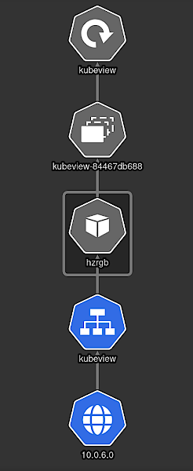
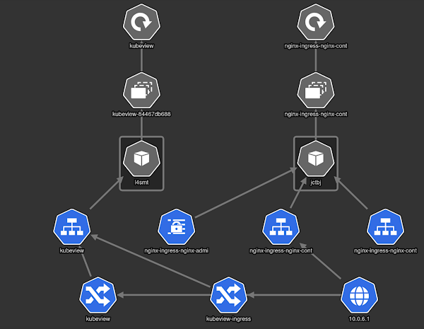

# K8S setup

## Network bridge setup

For the cluster to be able to access the network you will have to setup a
network bridge to a network that can access the internet. Here's an example if
you're running `NetworkManager` (which most distributions do).

Reboot or restart NetworkManager after creating the following files.
You should see a new `br0` interface when running `ip addr` and the original
network interface should have no IP address anymore:

```
...
3: enp6s0: <BROADCAST,MULTICAST,UP,LOWER_UP> mtu 1500 qdisc mq master br0 state UP group default qlen 1000
    link/ether b4:2e:99:32:99:9b brd ff:ff:ff:ff:ff:ff
...
7: br0: <BROADCAST,MULTICAST,UP,LOWER_UP> mtu 1500 qdisc noqueue state UP group default qlen 1000
    link/ether 76:23:c1:a9:29:cb brd ff:ff:ff:ff:ff:ff
    inet 192.168.2.155/24 brd 192.168.2.255 scope global dynamic noprefixroute br0
       valid_lft 36526sec preferred_lft 36526sec
...
```

### `/etc/NetworkManager/system-connections/bridge-br0.nmconnection`

This creates a new Network Bridge named `br0`

```
[connection]
id=bridge-br0
uuid=0285068e-c6e3-45ea-88d0-230d0963a963
type=bridge
interface-name=br0
permissions=

[bridge]
stp=false

[ipv4]
dns-search=
method=auto

[ipv6]
addr-gen-mode=stable-privacy
dns-search=
method=auto

[proxy]
```

### `/etc/NetworkManager/system-connections/bridge-slave-enp6s0.nmconnection`

This sets the network interface `enp6s0` to be a slave of the bridge.
Change `enp6s0` to the interface you use to connect to the Internet.

```
[connection]
id=bridge-slave-enp6s0
uuid=a2d946c6-663e-41ab-bb25-82eb1e65210a
type=ethernet
interface-name=enp6s0
master=br0
permissions=
slave-type=bridge

[ethernet]
mac-address-blacklist=

[bridge-port]
```

## Vagrant/KVM and Ansible setup to run the cluster

You'll have to edit some files to be able to access the cluster later on, this
is mainly hostnames and IP addresses.

All files referenced hereafter are relative to the `k8s-kvm` directory.

### `Vagrantfile`

```
# Net work prefix in which a single digit is appended
# ex 192.168.1.5 will have a master at 192.168.1.50 and workers starting
# from 192.168.1.51
NETWORK_PREFIX="192.168.2.24"

# base image to use for the cluster
IMAGE_NAME = "generic/ubuntu2004"
```

**Attention**: The network prefix is not an IP address, the scripts
_concatenate_ a number to that prefix (0 for the master, 1-n for the cluster
workers). Make sure this will not collide with your DHCP range if your router
dynamically allocates IP addresses in your network.

You can set for the base image what you want to use to run the containers on,
this is not a container base image, but the image that the container daemon runs
on. Best is to stick to Ubuntu LTS.

If you want more or less than 3 worker nodes you can set `NUM_NODES`, be sure
to not create more than 9 as the concatenation from above will fail.

You can change the CPU cores assigned to the nodes and the amount of RAM to
expend per node. Make sure to not overallocate the RAM. If you overallocate the
CPU cores of your machine you will get a similar effect to badly behaving
neighbors on AWS EC2 instances with VCPUs.

```
   config.vm.provider :libvirt do |libvirt|
    libvirt.cpus = 2
    libvirt.memory = 4096
```

### `hosts`

```
[kube-masters]
master1.kube.local ansible_host=192.168.2.240

[kube-nodes]
worker1.kube.local ansible_host=192.168.2.241
worker2.kube.local ansible_host=192.168.2.242
worker3.kube.local ansible_host=192.168.2.243

[ubuntu:children]
kube-masters
kube-nodes
```

Here we have to setup hostnames and the corresponding IP addresses. These are
the same IPs as we set up with the prefix in the `Vagrantfile`. The master gets
the `0`, the workers are numbered from `1`.

### `kube-master-init/tasks/main.yml`

We have one change in the cube master tasks file to allow a `kubectl` from
outside the master VM to control the kubernetes cluster:

```
  command: kubeadm init --pod-network-cidr=10.244.0.0/16 --apiserver-cert-extra-sans 192.168.2.240
```

Replace the IP address with the IP you used for the master. This will ensure the
self-signed certificate generated while running the setup procedure will include
the external IP address that is visible to the network.

## Setting up `libvirt`

Make sure to have `libvirtd` configured and running:
1. Change the config files to contain the values of the two sections below
2. Make sure `libvirtd` is run with the `--listen` parameter or you run the socket activated systemd version.
  - If your system has it start and enable `libvirtd-tcp.socket`
  - If you do not run in socket activation mode edit the systemd unit file via
    `systemctl edit libvirtd`
  - If you distribution has an external config file (e.g.
    `/etc/conf.d/libvirtd`) preferrably use that one.
3. (Re-)start `libvirtd`: `systemctl restart libvirtd`
4. Create a sasl user to access the virtualization daemon remotely:
```bash
saslpasswd2 -a libvirt <user>
```
5. Now you can use `virt-manager` or `virsh` to connect to the VM cluster to
  monitor everything, use the connection URL `qemu+tcp://<hostname>:16509/system`
  or if you have ssh working `qemu+ssh://<user>@<hostname>/system` and install
  your ssh pubkey on `<hostname>`

To verify running VMs run `virsh -c <connection_url> list`, you will be prompted
for your username and password (the one from the sasl database)

To avoid specifying the URL all the time use this:

```bash
export VIRSH_DEFAULT_CONNECT_URI="<connection_url>"
```

### `/etc/libvirt/libvirtd.conf`

```
listen_tcp = 1
tcp_port = 16509
listen_addr = "0.0.0.0"

unix_sock_group = "libvirt"
unix_sock_ro_perms = "0777"
unix_sock_rw_perms = "0770"
unix_sock_admin_perms = "0700"
unix_sock_dir = "/run/libvirt"

auth_unix_ro = "none"
auth_unix_rw = "none"
auth_tcp = "sasl"
```

and put yourself in the `libvirt` group or connect via TCP, see config below.

### `/etc/sasl2/libvirt.conf`

```
mech_list: digest-md5
```

**Attention**: `DIGEST-MD5` is not secure for production systems, only use this
on testing systems! On newer Systems you can also use `scram-sha-1` which is
secure.

## Creating the VM Cluster

To start the VM cluster just issue a `vagrant up` command, now vagrant will
configure the worker and master VMs.

## Deploying k8s

**Attention**: Make sure that you have the current version of kubeadm and
kubelet defined in `roles/kube-dependencies/tasks/main.yml`. Find the latest
supported version in https://packages.cloud.google.com/apt/dists/kubernetes-xenial/main/binary-amd64/Packages

To deploy kubernetes to the cluster run the corresponding ansible scripts.

```bash
ansible-playbook -i hosts bootstrap.yml
ansible-playbook -i hosts kube-masters.yml
ansible-playbook -i hosts kube-workers.yml
```

- `bootstrap` disables any automatic `apt` upgrades, disabled swap and creates a
  `kube` user in all VMs
- `kube-masters` sets up the k8s master node
- `kube-workers` sets up the k8s worker nodes

**Attention**: while running bootstrap you'll have to accept the ssh-keys of the
VM installations, so you have to type `yes<enter>` for each of the VMs

If the three playbooks did run without an error we have to tell the master node
how to find the worker nodes, for that we ssh into the master node:

```bash
ssh kube@<master_ip>
```

The password is `kubernetes`
If you run `kubectl get nodes` now, all nodes should display as `not ready`, so
let's tell kubernetes how to find the workers by installing a plugin:

```bash
kubectl apply -f https://raw.githubusercontent.com/coreos/flannel/v0.13.0/Documentation/kube-flannel.yml
```

### Creating a comfortable interface from your local machine

SSHing into the master node is a bit inconvenient so we can copy the `kubectl`
config of the master to our local machine and run `kubectl` from there:

```bash
cd $HOME
mkdir -p .kube
scp kube@<master_ip>:.kube/config .kube/config
chmod 600 .kube/config
kubectl get nodes
```

## Installing helm

Get it from your package repository or install it via the installer:

```bash
curl https://raw.githubusercontent.com/kubernetes/helm/master/scripts/get > get_helm.sh
chmod 700 get_helm.sh
./get_helm.sh
```

On OSX it seems to be in homebrew, so just run `brew install helm`

## Running your first app

A good example is the kube visualizer which displays what is going on in your
cluster:

```bash
helm repo add kubeview https://benc-uk.github.io/kubeview/charts
helm install kubeview kubeview/kubeview
```

Ignore the last line where the app is available under, we need a loadbalancer
to be deployed to make this actually accessible

You can verify that the app is running with `kubectl get pods` and see service
info with `kubectl get svc` which should display the `kubernetes` service and the
new `kubeview` service.

## Deploying a loadbalancer

Usually you will use the loadbalancer of your cloud provider for this, as we
are our own cloud provider here we need to install one ourselves. Everyone seems
to use `metalLB` for this, so we get us that one too:

We need a configuration for the service first:

```yaml
apiVersion: v1
kind: ConfigMap
metadata:
  namespace: metallb-system
  name: config
data:
  config: |
    address-pools:
    - name: default
      protocol: layer2
      addresses:
      - 10.0.6.0/24
```
If you want the service to be accessible from outside the local machine set the
address range to something you can actually route in your network. You can use
CIDR notation (e.g. `10.0.6.0/24` for the complete `10.0.6.x` subnet) or define
a range of addresses to use (e.g. `10.0.6.1-10.0.6.20`).

Now install `metalLB`:

```bash
kubectl apply -f https://raw.githubusercontent.com/metallb/metallb/v0.9.5/manifests/namespace.yaml
kubectl apply -f https://raw.githubusercontent.com/metallb/metallb/v0.9.5/manifests/metallb.yaml
kubectl create secret generic -n metallb-system memberlist --from-literal=secretkey="$(openssl rand -base64 128)"
```

And install the config:

```bash
kubectl apply -f <configfile>
```

If you check the service list now with `kubectl get svc` you will see the
external IP of your `kubeview` to be populated.

Further information: https://metallb.universe.tf/installation/



## Deploying an ingress (proxy frontend)

Sometimes we want to deploy microservices that run single endpoints that should
be routed under the same domain name, usually you'd use a reverse proxy like
nginx to route the URLs to the microservices. In k8s world this is called an
`Ingress` and typically actually uses `nginx`.

At first we have to install the ingress pod:

```bash
helm repo add ingress-nginx https://kubernetes.github.io/ingress-nginx
helm install nginx ingress-nginx/ingress-nginx
```

You'll need an ingress definition to be able to tell the router where to route:

```yaml
apiVersion: networking.k8s.io/v1
kind: Ingress
metadata:
  name: kubeview-ingress
  annotations:
    kubernetes.io/ingress.class: nginx
spec:
  rules:
  - http:
      paths:
      - pathType: Prefix
        path: "/"
        backend:
          service:
            name: kubeview
            port:
              number: 80
```

Save that to a YAML file and run `kubectl create -f <filename>` to create
the ingress.

**Attention**: Even when using an ingress you still need a loadbalancer, else
the `EXTERNAL-IP` field of the ingress service will be `<pending>`

To try this with `kubeview`:
1. remove the service with `helm del kubeview`
2. re-install with `helm install kubeview kubeview/kubeview --set ingress.enabled=true`

Further documentation: https://kubernetes.io/docs/concepts/services-networking/ingress/


